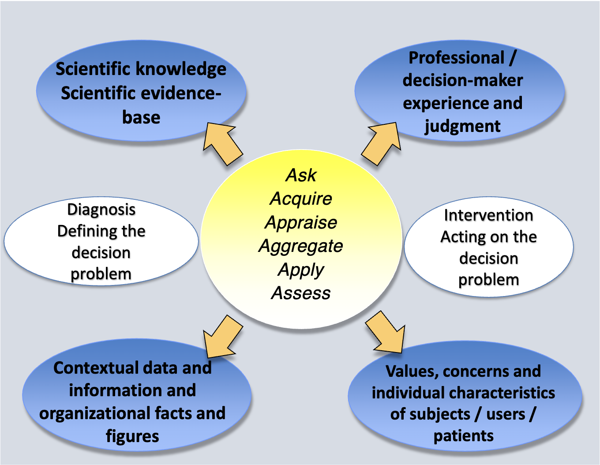

# Flash Summary

## Decision-making, Decision Sciences and Evidence-Based Decision-Making

- **Prospect Theory** - Losses and gains are valued differently
  - Certainty (of gain and of loss)
  - Isolation effect - people focus on differences between options rather than similarities
  - Loss aversion

- **Heuristics and cognitive biases in decision making**
  - **Availability**: Judgments distorted by easily recalled events
  - **Selective perception**: Expectations bias observations
  - **Illusory correlation**: Encourages belief that unrelated variables are correlated
  - **Conservatism**: Ignoring full effect of new information
  - **Law of small numbers**: Overestimating representativeness of small groups
  - **Regression bias**: Failure to allow for regression to the mean
  - **Wishful thinking**: Probability of desired events judged too highly
  - **Illusion of control**: Overestimating personal control over outcomes
  - **Logical reconstruction**: “Logical” reconstruction of inaccurately recalled events
  - **Hindsight bias**: Overestimation of predictability of past events

- **Antidotes**:
  1. Use frameworks for strategic analysis
  2. Use multiple perspectives
  3. Devil’s advocate
  4. Consider improbable or unpopular assumptions
  5. Re-evaluate over time

- **Decision Models**:
  - Modelos Normativos
    - Árvores de Decisão
    - Diagramas de Influência
    - Redes Bayesianas/Belief
    - (Markov Chains)
  - Modelos Descritivos
    - Falácias e viéses
    - Prospect Theory

**Características de um Sistema de Saúde de qualidade (10)**:
  - Care is based continuous healing relationships
  - Care is custumized according to patient needs and values
  - The patient is the source of control
  - Knowledge is shared and informations flows freely
  - Decision Making is evidence-based
  - Safety is a system property
  - Transparency is necessary
  - Needs are antecipated
  - Waste is continuously decreased
  - Cooperation among clinicians is a priority

**What is EBM?**
  - “Evidence Based Medicine is the conscientious, explicit and judicious use of current best evidence in making decisions about the care of individual patients”
  - “Evidence-based medicine is the integration of best research evidence with clinical expertise and patient values”

  

  - 6 passos para Decisões Baseadas em Evidência:
    1. Ask
    2. Acquire
    3. Appraise (relevance; impact; validity; applicability)
    4. Aggregate
    5. Apply
    6. Assess

**What is Personalized Medicine / Precision Medicine?**
  - Personalized medicine is defined as a model for medicine that is customized based on the individual patient’scharacteristics (genetic, biological, physical, clinical, psychological, social, economic, etc.). All aspects of care can be personalized including medical decisions, treatments, practices, products or services used.

## Technology and health technology

- **Technology:** É uma aplicação prática do conhecimento científico utilizado para resolver um problema
  - Características fundamentais:
    - Natureza física
    - Propósito
    - Estado de Difusão

- Motivos pelos quais a tecnologia é cada vez mais importante:
  - Avanços na ciência
  - Propriedade intelectual
  - Populações envelhecidas
  - Maior prevalência de doenças crónicas
  - Novas doenças
  - Diferenças nos financiamentos e estruturas de gestão
  - Incentivos financeiros
  - Exigência pública
  - Uso off-label
  - Testes desnecessários
  - Treino clínico de especialidade
  - Competição
  - Evitar de má prática clínica
  - Economias em crescimento

5 fases do processo de decisão de inovação:
  1. Conhecimento
  2. Persuasão
  3. Decisão
  4. Implementação
  5. Confirmação

**O que é Health Technology Assessment?**
É um campo multidisciplinar e transdisciplinar de avaliação da investgação científica que avalia, explora e reporta as propriedades, características, consequências e impactos das tecnologias de saúde, com o objetivo de dar suporte aos processos de decisão em saúde e medicina a todos os níveis, desde os doentes a politicas de saúde nacionais.

- Tipos:
  - Orientadas a tecnologia
  - Orientadas a problema
  - Orientadas a projeto

Que métodos utiliza?
- Métodos baseados em dados primários: envolvem a recolha de dados originais
  - Estudos experimentais
  - Estudos quasi-experimentais
  - Estudos observacionais
- Métodos de síntese de evidência
   -Revisões sistemáticas
   - Meta-analises
   - Modelação (árvores de decisão, modelos de estado-transição)
   - Desenvolvimentos de consensus
   - Revisões da literatura não estruturadas
   - Opinião de peritos
- Métodos de Análise de Decisão e Modelação
- Métodos de Avaliação Económica
    - Parciais - Análise de custos
    - Completos:
      - Cost-minimization
      - Cost-benefit
      - Cost effectiveness
      - Cost-Utility
- Métodos de Desenvolvimento de Consenso
- Análise ética
  - Casuistry
  - Coherence Analysis
  - Principlism
  - Interactive, participatory HTA approaches
  - Social shaping of technology
  - Wide reflective equilibrium

## Assessment of Efficacy and Effectiveness of Healthcare Interventions

Tipos de randomização:
- Randomização completa
- Randomização por blocos permutados
- Randomização cross-over
- Randomização estratificada (blocked)
- Desenho fatorial
- Randomização por clusters

- **Análise de acordo com intenção de tratar**
  - Objetivo: identificar o melhor tratamento para a prática clínica
- **Análise por protocolo**
  - Objetivo: compreender a eficácia da intervenção

- **Medidas de efeito/associação**
  - Medidas Absolutas:
    - ARR
    - NNT
  - Medidas Relativas:
    - RR
    - RRR
    - OR

RRR = ARR/REC

## Real-world data studies

**Pragmatic versus Explanatory**
Schwartz and Lellouch1 proposed a distinction between explanatory trials, which confirm a physiological or clinical hypothesis, and pragmatic trials, which inform a clinical or policy decision by providing evidence for adoption of the intervention into real-world clinical practice.

**Assessing the nature of the trial based on a pragmatic-explanatory continuum - items:**
- Critérios de eligibilidade
- Flexibilidade da intervenção experimental
- Expertise do praticante da intervenção experimental
- Intervenção comparativa
- Expertise do praticante da intervenção comparativa
- Intensidade do follow-up
- Outcome primário
- Compliance dos participantes em relação à intervenção
- Adesão do praticante ao protocolo de estudo
- Análise do outcome primário

## Methods in Evidence Synthesis

**Métodos de Síntese de evidência**
- Revisões sistemáticas da literatura
- Revisões não sistemáticas da literatura (ex: revisões narrativas)
- Meta-análises
- Métodos de consenso
- Análise de decisão, modelação e métodos de simulação

**Fases de síntese de evidência**
- Background
- Definição da pergunta de investigação
- Pesquisa e seleção de estudos primários
- Extração e processamento de dados
- Avaliação de qualidade
- Análise de dados, heterogeneidade e viéses de publicação
- Protocolo e disseminação de resultados

**Limitações das revisões sistemáticas**
- Dados secundários
- Dados agrupados
- Qualidade dos estudos heterogénea
- Nem sempre é possível/desejável fazer agregação da informação
- Os métodos para agregação dos dados ainda estão em desenvolvimento

**Fases e tarefas para conduzir uma revisão sistemática**
  1. Definição de uma pergunta de investigação
  2. Definição de critérios de seleção
  3. Definição de uma estratégia de pesquisa
  4. Seleção de estudos
  5. Avaliação da qualidade dos estudos
  6. Extração de dados
  7. Análise e processamento dos dados
  8. Disseminação dos resultados

**Tipos de métodos de pesquisa**
  1. Bases de dados bibliográficas: MEDLINE; EMBASE; CENTRAL
  2. Pesquisa manual: revistas relevantes; livros de conferências
  3. Referências incluídas noutros estudos
  4. Outras revisões sistemáticas
  5. Contactar especialistas
  6. Bases de dados de recrutamento ou ensaios ativos ou de ensaios completos

**Métodos para explorar as diferenças obtidas em diferentes estudos**
1. Análise descrtiva/gráfica
2. Análise de subgrupos
3. Meta-análise cumulativa
4. Pooled analysis (índice de qualidade?)
5. Análise de sensibilidade
6. Meta-regressão

**Tipos de Medidas de Efeito**
- Variáveis contínuas:
  - Diferença de média
  - Standardized Mean Difference
- Variáveis Binárias
  - Proporções - Prevalência; Incidência cumulativa
  - Taxas - Taxa de incidência
  - Diferença de riscos - Redução de risco absoluta
  - Risco relativo
  - Odds ratio
- Outras
  - Coeficiente de correlação
  - Hazard ratio
  - NNT

- Modelo de efeitos fixos
- Modelo de efeitos aleatórios

**Avaliação de Heterogeneidade**
- Recomendações:
  - Avaliar a magnitude
  - Identificar causas
  - Explorar causas
  - Adaptar os métodos de análise
- Fontes:
  - Clínica
  - Metodológica
- Avaliação:
  - Estatística Q de Cochran (teste chi-quadrado)
  - I2
  - Forest plot
  - Análise de subgrupos
  - Análise de sensibilidade

**Viéses de reporte**
  - Tipos:
    - Viés de publicação
    - Time lag
    - Duplicate publication
    - Location bias
    - Citation bias
    - Language bias
    - Outcome reporting

## Economic Evaluation of Healthcare Technologies

An Economic Evaluation is an explicit, formal, systematic and quantitative approach used in the comparative analysis of alternative courses of action in terms of both their costsand consequences in order to support policy decisions regarding allocation and distribution of the scarce resources available, and the analysis of its determinants and outcomes.

- Decisão a questão de estudo:
  - Qual o problem?
  - Quais as opções?
  - Qual a audiência?
  - Qual a perspectiva?
  - Qual o horizonte temporal?
  - Qual o tipo de estudo?
- Avaliação de custos:
  - Identificação
  - Medição
  - Valorização
  - Cálculo
- Avaliação de efeitos de saúde:
  - Identificação

**ACER**: rácio entre a estimativa média dos custos médios ou esperados para uma alternativa e a sua efetividade média ou esperada

**ICER**: é de uma dada alternativa em relação a um comparador.

**Budget Impact Analysis**: addresses the financial consequences and expected changes in the expenditure of a healthcare system after the adoption and diffusion of a NEW healthcare technology given budget constraints

## Methods in Decision Analysis and Decision Modelling
