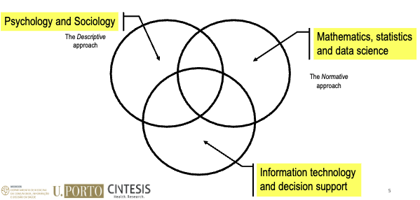

# Lesson 01 - Decision-making, Decision Sciences and Evidence-Based Decision-Making

## Summary

- Decision-making, decision sciences and decision analysis
- The evolution of medicine and evidence-based medicine
- The evidence-based approach
- Translating research into practice and practice into research

## Decision-making, Decision Sciences and Decision Analysis

- Life involves making decisions!
  - Decision makers require guidelines and expert support
- Most important decisions involve
  - multiple uncertainties and complexities
  - multiple outcomes, which can often be evaluated using multiple attributes/criteria
  - Multiple decision-making stages and long time delays between action and reaction
  - Need information gathering and analysis at every stage
  - Multiple decision makers and stakeholders and conflicting objectives and timings
- Examples in everyday life include business, government policy, medicine, law, and personal decisions

## The disciplines of decision Making

## Bounded rationality / prospect theory

**The principle of ”bounded rationality”**

> ”The capacity of the human mind for formulating  and solving complex problems is very small compared to the size of those problems whose solution is required for objectively rational  behavior in the real world or even for a reasonable approximation to such objectivity.”

System 1
- Fast, intuitive, associative
- Initial reactions swift and appropriate
- Generally very good
- Short term predictions accurate
- Uses heuristics
- Often affected by systematic biases
- Doesn’t understand logic and statistics
- Cannot be turned off

System 2
- Slow (lazy)
- Deliberate, self control
- Reasoning & rationality
- Cognitive effort, hard work
- Ego depletion

**Prospect Theory – Kahneman & Tversky**

 > Prospect theory assumes that losses and gains are valued differently, and thus individuals make decisions based on perceived gains instead of perceived losses. Also known as the "loss-aversion" theory, the general concept is that if two choices are put before an individual, both equal, with one presented in terms of potential gains and the other in terms of possible losses, the former option will be chosen.

There are 3 main factors that influence decision making in prospect theory:

- Certainty: In prospect theory, there are two types of certainty. The first is the certainty of gain, and
the second is the certainty of loss.
- Isolation Effect: In prospect theory, the isolation effect occurs when people focus on differences between  options rather than similarities. This is to reduce the cognitive strain placed on our brains  and simplify the decision-making process.
- Loss Aversion: In prospect theory, loss aversion is where an individual’s fear of losses is greater than  their joy of gains. In other words, people prefer to minimise losses than maximise gains.
