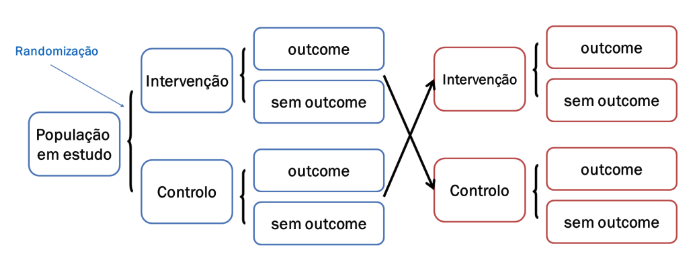
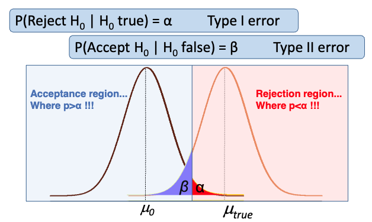

# Lesson 03 - Assessment of Efficacy and Effectiveness of Healthcare Interventions – Clinical Trials

> Experimental studies in humans - The Randomized Controlled Trial (RCT)

## Causality

## Study Design

Question: What is the effect of a therapeutic intervention?
- **Study design**: Experimental study (study with [1] direct control of the intervention and [2] randomisation)
  - Comparison (Control group)
  - Direct control of the intervention (Experimental or intervention group)
  - Randomisation
  - Control of inespecific effects (Placebo effect, Hawthorne effect, others)
  - Blinding
- **Selection of participants**:
  - Inclusion/exclusion criteria (affect the generalisability of the study’s conclusions –external validity)
- **Selection of data collection methods**:
  - Outcome variables (Clinically relevant variables used for group comparison –e.g., mortality, morbidity, quality of life, etc.)

| The Revised CONSORT Statement for Reporting Randomized Trials |      |
|--------------------------------------------------------------|------|
| **Methods**                                                  |      |
| Participants                                                 | 3    |
| Interventions                                                | 4    |
| Objectives                                                   | 5    |
| Outcomes                                                     | 6    |
| Sample size                                                  | 7    |
| **Randomization**                                            |      |
| Sequence generation                                          | 8    |
| Allocation concealment                                       | 9    |
| Implementation                                               | 10   |
| **Blinding (masking)**                                       | 11   |
| **Statistical methods**                                      | 12   |

## Phases of Clinical Trials

> Phases I II, III and IV

### Phase I Clinical Trials

- Small number of participants (~20-80)
- Asessment of safety, dose safety range, pharmakokynetics, main effects and main adverse reactions
- Usually “single arm” and in healthy volunteers

### Phase II Clinical Trials

- Higher number of participants (~40-100)
- Efficacy and safety assessment in specific indications
- Can be single arm or with randomisation. Usually conducted in patients with specific diseases

### Phase III Clinical Trials

- Larger samples (usually >100-200 participants)
- Assessment of efficacy and efficiency; adverse reactions monitoring
- Encompass randomisation and comparison with other treatments or placebo. Conducted in patients with specific diseases

### Phase IV Clinical Trials

- Post-commercialisation trials
- Efficacy and safety monitoring in different populations
- Less frequently conducted

### Summary

| Phase | Description | Number of subjects | Dose | Endpoints | Timing |
|-------|-------------|--------------------|------|-----------|--------|
| Phase 0 "Exploratory" | First-in-man early trial to determine if drug engages its expected target | 10-15 healthy volunteers | Single, low dose (<1% of dose calculated to produce a clinical effect) | Not expected to show clinical effect or significant adverse effects. Helps to choose between competing chemical analogs for further study. | Can be conducted with prior approval while final IND review is pending |
| Phase I | Initial safety evaluations, determine safe dosage range, identify common side effects, study toxicology profile of the drug | 20-80 healthy volunteers | - Single dose   - Single ascending dose   - Multiple ascending dose | Escalation of dose ends when unacceptable side effects occur; the previous dose is considered the maximum tolerated dose. | Together with Phase 0 trials, first clinical IND process |
| Phase II | Begin to explore efficacy while maintaining safety | 100-300 volunteers with the targeted medical condition | Multiple dose trials, often conducted against placebo | Explores clinical effects against the targeted condition, and reveals the less-common side effects | Conducted after report to FDA of results of Phase I trials |
| Phase III | Final confirmation of safety and efficacy | 1,000-3,000 subjects with the targeted medical condition | Multiple dose trials, variable ascending doses | Confirms clinical efficacy of the drug against the targeted condition and evaluates safety and side effects | Conducted after report to FDA of results of Phase II trials |
| Phase IV | Any trials conducted after FDA approval of the drug | Number of subjects depends on trial endpoints | Variable | Confirms clinical efficacy and safety and explores other possible drug uses; may be required as a condition of drug approval | Conducted after release of the drug by the FDA for marketing |

## Types and Methodological Principles

**Basic concepts**:
- Randomization
- Stratification (blocking)

**Types of randomization**:
- Complete randomized design
- Random permuted blocks design
- Randomized cross-over design
- Randomized stratified (blocked) design
- Factorial designs
- Randomized clusters design

### Randomized Factorial Design

Adapted from: Trochim, William M. The Research Methods Knowledge Base, 2nd Edition. Internet WWW page, at URL: [http://www.socialresearchmethods.net/kb/] (version current as of October 20, 2006).

### Experimental studies with stratification

Adapted from: Trochim, William M. The Research Methods Knowledge Base, 2nd Edition. Internet WWW page, at URL: [http://www.socialresearchmethods.net/kb/] (version current as of October 20, 2006).

### Random permuted blocks design

### Randomized cross-over design

### Randomized clusters design

### Pragmatic experimental studies in a real-life context

- Externalities included in the total set of determinants of a treatment response
- Results assessed according to what is relevant for decision-making in daily clinical practice
- Participants corresponding to those patients attending the clinical practice (and not to highly-selected patients)

## Outcome assessment and statistical analysis

### Other Hypothesis and comparisons

### Statistical Analysis - Intention-to-treat analysis

**Análise de acordo c/ intenção de tratar**
> Objetivo: identificar o melhor tratamento para a prática clínica
- Participantes são analisados de acordo com os resultados da randomização, mesmo que não tenham cumprido com a opção para a qual estavam alocados
- Análise que avalia a efetividade da intervenção (dá resposta à questão pragmática)
- Deve ser a principal análise reportada num estudo experimental

**Análise por protocolo**
> Objetivo: compreender a eficácia da intervenção
- Participantes são analisados de acordo com o tratamento/opção que efetivamente completaram
- Análise que avalia a eficácia da intervenção (dá resposta à questão explanatória)
- Não tem em conta perdas de follow-up, contaminação...

### Statistical Analysis - Subgroup analysis

**Subgroup analysis** – A difference in treatment efficacy in specific subgroups is only acceptable in the presence of affirmative answers to all of the following questions:
- Does it make sense from the biological and clinical point of view?
- Is the observed difference clinically and statistically significant?
- Was the hypothesis described before the beginning of the study? (instead of the results being found by pure chance)
- Was it simply one of the results of the few assessed subgroups?
- Are there independent studies confirming the results?

### Statistical Analysis - Other

- **Interim analysis and stopping rules**
- **Adaptive designs**
  - The term “adaptive design” is used in many different ways.
  - Used to describe any multi-stage trial where later stages are based, in part, on what happened in earlier stages

## Critical Appraisal of Randomized Clinical Trials

**Three basic questions:**
- Are the results of this study valid?
- Are the (valid) results of this study relevant?
- Are the (valid and relevant) results of this study applicable to my patient?

### Are the results of this study valid?

**Was there an adequate randomisation?**
- Complete randomized design
- Random permuted blocks design
- Randomized cross-over design
- Randomized stratified (blocked) design
- Factorial designs
- Randomized clusters design

**Was the randomisation sequence concealed from the professionals responsible for assigning the interventions?**
- “Allocation concealment”
- “Concealed randomization list”
- Use of sealed, opaque and inviolable envelopes
- Randomisation center for assigning the intervention by phone contact

**Were the experimental and control groups comparable at baseline regarding other variables that may, eventually, influence the study’s results?**
- Baseline characteristics, measurements or variables!
- Careful analysis of “table 1”

**Were all patients assessed in the groups to which they were initially randomised?**
- Does the analysis respect the initial assignment of interventions?
- “Once randomized should be analized!”
- “Intention-to-treat analysis”

**Were all elements involved in the study blinded or masked on the treatment group?**
- Patients, physicians, researchers responsible for analysing outcome variables, researchers responsible for data analysis (single blind, double blind, triple blind)

**Was the follow-up period sufficiently long and complete?**
- Ideally, the follow-up should be complete
- Rule of the thumb: at least 80% of follow-up

**Are the outcome variables adequate?**
- Definition of primary and secondary outcomes (end-points)
- Problems associated with surrogate outcomes (end-points)
- Problems associated with combined outcomes (end-points)

**Were the comparators adequately chosen?**
- No treatment or placebo
- Alternative active interventions

### Are the results of this study relevant?

**What is the effect size for the treatment efficacy?**
**What is the precision of the estimates for the treatment efficacy?**
**Is the results’ presentation adequate?**

### Are the valid and relevant results of this study applicable to my patient?

**Is my patient very different from the study participants?**
**̶In my setting, is the treatment available and is it applicable in the clinical practice?**
**̶What are the potential advantages and disadvantages of the treatment in this specific patient?**
**̶What are the opinions, values and expectations of our patient in relation to the outcome we are trying to avoid and to the treatment we are proposing?**

## Association or effect measures

An association or effect measure quantitatively assesses the strength of the (causal) association between an intervention or factor and a certain outcome

**There are two types of effect/association measures**:
- *Absolute measures* – ARR, NNT
- *Relative measures* – RR, RRR, OR

> As an example, consider a randomised controlled trial (RCT) in patients admitted in an ICU and in which the hospital mortality was assessed in the experimental and in thecontrol groups.

| Result/Group     | Hospital deaths | Hospital survivals | Total |
|------------------|-----------------|--------------------|-------|
| Experimental group | 10              | 90                 | 100   |
| Control group     | 20              | 80                 | 100   |
| Total             | 30              | 170                | 200   |

- **Risk of the event in the control group (REC)** – estimate of the probability of the event in the control group (REC= 20/100 = 0,2 = 20%).

- **Risk of the event in the experimental group (REE)** – estimate of the probability of the event in the experimental group (REE = 10/100 = 0,1 = 10%).

- **Risk ratio (Relative Risk; RR)** – Relative effect size corresponding to the risk in the experimental group dividing by the risk in the control group (RR = REE/REC = 0,1/0,2 =  0,5), informing on the relative frequency of the event in the experimental group compared to the control group.

- **Odds Ratio (OR)** – Relative effect measure, corresponding to the event odds in the experimental group dividing by the event odds in the control group (OR = (10/90) / (20/80) =  0,11/0,25 = 0,44), informing on the relative frequency of the event (expressed by odds) in the experimental group compared to the control group.

- **Absolute risk reduction (ARR)** – Absolute effect measure, estimated by the absolute difference between the risk in the control group and the risk in the experimental group (RAR = REC-REE = 0,2-0,1 = 0,1 = 10%). This measure is interpreted as the absolute reduction of the event risk associated with the intervention.

- **Relative risk reduction (RRR)** – Measure of potential impact (it is not strictly an effect measure), estimated by dividing the absolute risk reduction by the risk of the event in the control group (RRR = ARR/REC = 0,1/0,2 = 0,5 = 50%). The RRR estimates the impact of the intervention in the population and can be interpreted as the risk proportion specifically decreased by the intervention.

- **Number needed to treat (NNT)** – Absolute measure, estimated by the inverse of the absolute risk reduction (NNT = 1/ARR  = 1/0,1 = 10). This measure estimates the number of individuals that would be needed to treat with the intervention in order to prevent a single event (death). In  this case, we would need to treat 10 individuals with the intervention to prevent an additional deaths.

### Precision of the effect measures

- The effect measures provided in a study are always estimates of the true value of that parameter in the population
- Naturally, effect estimates resulting from samples of 1000 participants will be more precise (less sensitive to random errors related to the sampling process) than estimates resulting from samples with 50 participants
- The sample size is an important determinant of the precision. However, the frequency of the event in the groups, the variance of the outcome variable and the adopted confidence level are also relevant factors

> The 95%CI are intervals which, built based on the applicable statistical inference methodology, provide a notion of the uncertainty associated with the estimation of the respective Effect size

## Annex - Statistical analysis of clinical trials

### Statistical Significance (p-value)

- Based on the p-value we can then decide to Accept or Reject H0
- If the p-value is small, we reject H0 and say that the result is statistically significant (the sample has little compatibility with H0)
- We should define beforehand what is the cut-off for “small p-value”
- This cut-off is designated as the level of significance (α)
- Although this choice is arbitrary, in medical research 0.05 is often used
- So, for α = 0.05, if p<0.05 then we reject H0

### Errors

### Power

