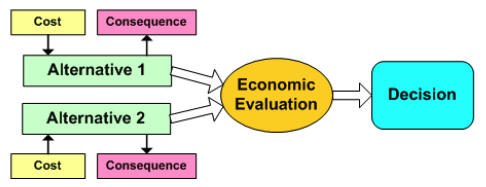
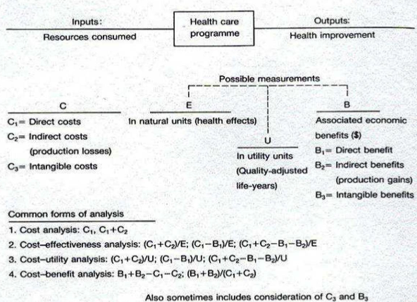
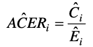
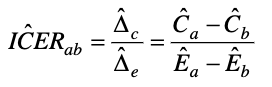
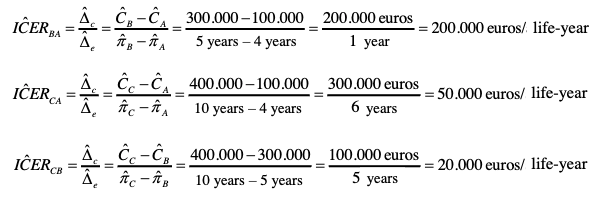
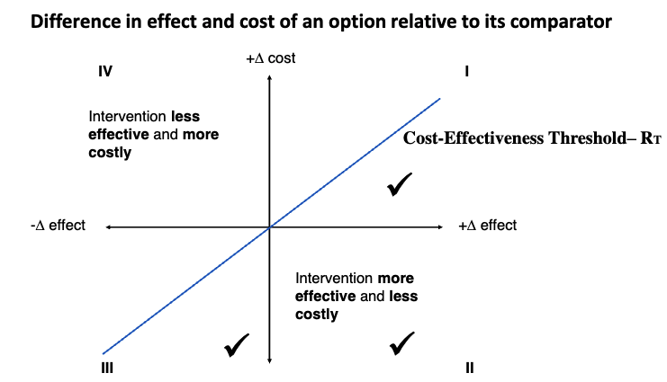
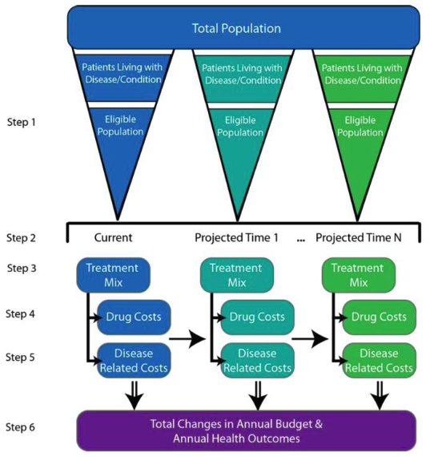
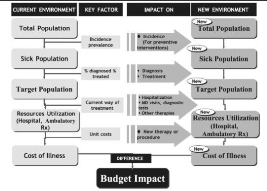
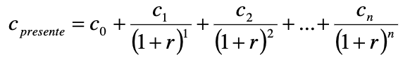

# Lesson 06 - Economic Evaluation of Healthcare Technologies

## Basics of Health Economics and the Importance of Economic Evaluation

**The ‘Health Economic’ problem**

- Unlimited healthcare “demands/needs/wishes” with rapid growth in health expenditure.
- Scarce or limited health sector resources.
- Choosing between ”demands/needs/wishes” we can “afford” given our available resources or “budget”.
- These are important problems for a wide range of stakeholders from policy makers and managers to healthcare professionals, patients and the society.

**Concept of opportunity cost**

“The value of forgone benefit which could be obtained from a resource in its next-best alternative use”.

The aim is to choose interventions where benefits outweigh opportunity cost.

**What is Health Economics?**

Theoretical framework to help healthcare professionals, decision-makers or governments to make choices on...
...HOW to maximize the health of population given constrained health care resources.

The main goals of health economists are...
- To understand the relationship between resources used and health outcomes achieved by alternative options ...and compare!

- Economic evaluation is used to ensure that limited resources are allocated as efficiently as possible.
  - **Technical efficiency**: meeting a given objective at least cost.
  - **Allocative efficiency**: producing exactly what society wants.
- Society may have other goals when allocating resources: equity or ethical issues.
  - **Horizontal equity**: ‘equal treatment of equals’.
  - **Vertical equity**: ‘unequal treatment of unequals’.
- Promoting cost consciousness – the economic judgement of health care operations – impacts the clinical decision making processes

**Economic evaluation is...**

- “The comparative analysis of alternative courses of action in terms of both their costs and consequences in order to assist policy decisions” (Drummond et al,1997)
- Economic evaluation is not “choosing the cheapest”.

- An Economic Evaluation is an explicit, formal, systematic and quantitative approach used in the comparative analysis of alternative courses of action in terms of both their costs and consequences in order to support policy decisions regarding allocation and distribution of the scarce resources available, and the analysis of its determinants and outcomes

**Complete vs Partial Economic Evaluation**
- A **Complete Economic Evaluation** is the comparative analysis of alternative courses of action or interventions in terms of both their costs and consequences;
- as opposed to a **Partial Economic Evaluation**, where only costs are considered Economic Evaluation

- The fundamental aspects of a Complete Economic Evaluation are:
  - The adequate measurement and analysis of the consequences (health outcomes or health effects) of the different alternatives or interventions
  - The adequate measurement and analysis of the costs of the different alternatives or interventions

Different types of studies when analysing consequences and costs of alternatives:
1. Descriptive or comparative studies analysing only costs of one or more alternatives – **Partial Economic Evaluation – Economic Impact Analysis (Cost-of-Illness study) or Cost Analysis**
2. Comparative studies analysing costs and consequences of two or more alternatives –Complete Economic Evaluation **(Cost-Minimization, Cost-Benefit, Cost-Effectiveness and Cost-Utility Analysis)**

## Generic Steps in an Economic Evaluation

### Operational phases in economic evaluations

1. Framing the decision-making process and deciding upon the study question
2. Assessment of costs and consequences
3. Incremental analysis, adjustment for time preferences and assessment and exploration of uncertainty
4. Presentation and dissemination of conclusions supporting the decision-making process

#### 1. Framing the decision-making process and deciding upon the study question

- **Identifying the decision-making problem and aims of evaluation**
  - What is the problem?
  - Why is this problem important?
  - What aspects of the problem need to be explained?
- **Choosing the alternative options**
  - Describing the interventions accurately.
  - Defining the counterfactual intervention (comparator).
- **Defining the audience**
  - Defining the info needs of the audience.
  - Considering how the audience will use the study results.
- **Defining the perspective of the study**
  - Patient / Providers / Payers / Healthcare system / Society.
  - Choosing a perspective depends on the audience.
- **Defining the time frame and analytic time horizon**
  - Analytic horizon > Time frame.
- **Choosing the type of study and study design**
  - Type of study: COIA / CA / CMA / CBA / CEA / CUA
  - Prospective / Retrospective / Model
  - Depends on data, time and resources available.

#### 2. Assessment of costs and consequences

- **Assessment of costs**
  - **Identification of costs**
    - Cost type: direct vs indirect vs intangible
  - **Measurement**
    - Measure in natural physical units (e.g. hours of labour time)
  - **Valuation**
    - Market prices (e.g. wage rates) used unless strong belief they do not reflect opportunity cost (e.g. volunteers)
  - **Calculation**
    - Multiply unit of measurement by unit cost (e.g. 2 hours of time at $5 per hour = $10 labour cost)
- **Assessment of health effects**
  - **Identification**
    - Which outcome measure is employed depends on the objective of the evaluation.
  - **Measurement**
    - Measure effectiveness not efficacy in natural physical units.
  - **Valuation if appropriate in terms of**
    - Natural physical units (e.g. Life Years, Mortality, Disability)
    - Utility (e.g. QALY, DALY, HYE)
    - Money (e.g. WTP)

#### 3. Incremental analysis, adjustment for time preferences and assessment and exploration of uncertainty

- **Incremental analysis**
  - Incremental analysis of costs and consequences (e.g. ICER, INB)
- **Discounting – adjustments for time preferences**
  - Prefer to have benefits now and bear costs in the future – “time preference”
  - Rate of time preference is termed “discount rate”
  - To allow for differential timing of costs (and benefits) between programmes all future costs (and benefits) should be stated in terms of their present value using discount rate.
  - Thus, future costs given less weight than present costs.
- **Annuitization of capital costs**
  - Capital costs represent an investment at start-up in an asset which is used and depreciated over time.
  - Annualise the initial capital outlay over the useful life of asset.
- **Assessment and exploration of uncertainty**
  - Process of assessing the robustness of an economic evaluation by considering the effects of uncertainty, consisting in:
    - Identifying the (uncertain) variables.
  - Specifying the plausible range over which they should vary.
  - Performing Sensitivity Analysis:
    - One-way analysis / Multi-way analysis
    - Extreme scenario analysis
    - Threshold analysis
    - Deterministic / Probabilistic

## Types of Economic Evaluation

### Economic Impact Analysis and Cost Analysis

- In economic impact analysis (cost-of-illness study) and cost analysis only costs are assessed and consequences or health effects of alternatives are not considered in the analysis
- **Economic impact analysis**
  - An economic impact analysis or cost-of-illness study estimates total costs of a disease, condition or clinical context
    - Medical and non-medical costs
    - Productivity losses
  - Generally reported as cost:
    - Annual total cost
    - Average patient lifetime cost
  - Shows potential benefits of technologies, interventions or programs
- **Cost analysis**
  - First step of a full economic evaluation
  - Estimates total costs of a technology, intervention or program or compares different alternatives considering only their costs
  - Estimates total program costs and determines who incurs those costs
  - Programmatic cost analyses include all the resources required to implement an intervention, such as personnel, space and utilities, travel, materials, and supplies.
  - Offers foundation for budget justification, decision-making, and forecasting

### Cost Minimisation Analysis

- Comparative analysis of two or more alternatives taking into account their costs and consequences
- However, in this type of study consequences or health effects of the alternatives are assumed equal
- Ideally, this assumption should be based on scientific evidence showing the non-inferiority or equivalence of alternatives
- Ultimately, only costs are considered in the comparative analysis of the alternatives

In this type of analysis we aim to answer the following question:
> Which of the alternatives has lower costs assuming they are equally effective?

- Results should be presented in monetary units in the form of differences or ratios of costs between the alternatives

### Cost-Benefit Analysis

- Cost-benefit analysis is a form of complete economic evaluation
- Comparative analysis of two or more alternatives taking into account their costs and consequences or health effects
- In this type of analysis the consequences or health effects of alternatives are measured in monetary units
- Lists all costs and benefits over time
  - Can have different time lines for costs and benefits
  - Can include non-health benefits

- In this context, Benefits are defined as the consequences, effectiveness or health effects of alternatives translated into monetary units, which are then directly comparable to the monetary units of costs

In this type of analysis we aim to answer the following question:
> Is this program or intervention better than the alternative taking into account their costs and benefits (consequences, effectiveness or health effects of alternatives translated into monetary units)?

- Assessing program benefits in a cost-benefit analysis is a little more challenging than assessing program costs
  - Benefits can be direct, indirect, or intangible
    - Direct benefits
      - E.g. Medical expenditures saved for other purposes
    - Indirect benefits
      - E.g. Potential increased earnings or productivity gains
    - Intangible benefits
      - E.g. Psychological benefits of health, satisfaction with life

- The main challenge in a cost-benefit analysis is to translate the consequences, effectiveness, health effects or health outcomes of alternatives into monetary units
- Example of a hard and ethically complex task is the translation into monetary units of:
  - Quantity of human life – Life-years of survival
  - Quality of human life
  - Satisfaction, pain or suffering of individuals

Conceptual frameworks and methodological proposals to translate consequences, effectiveness, health effects or health outcomes of alternatives into monetary units:
- Valuing the direct benefits of a program, such as medical savings, follows the same methods used to estimate costs
- Valuing indirect benefits in terms of productivity gains follows also similar methods as the estimation of productivity costs, using the human capital method
- In addition, three other methods can be used for valuing benefits – Friction cost method, Revealed preferences and Stated preferences

**1) The human capital approach**
- The human capital approach for valuing indirect benefits in a benefit-cost analysis is based on the theory of investment. People are viewed as capital investments whose sole purpose is to produce for society at large.
- Assumes that workers have a value equal to their earnings, because the fair market workplace would not pay workers more than they are worth. The value of their production potential in society is based on the wages they earn, including all the benefits associated with those wages. Some adjustments for their production potential within the household are usually included as well.
- If a disease, injury, or illness affects a person’s productivity, the cost to society is valued in terms of lost earnings. Thus, the human capital approach is fairly straightforward when valuing a death associated with a disease. However, morbidity is more complicated to valuate (absenteeism and presenteeism) and may be dependent on occupation
- An example of how you would estimate the indirect benefits associated with a hypertension prevention program that increased productivity:
  - If annual income is 40,000 dollars and the fringe rate is 25 percent, then total earnings are 50,000 dollars.
  - If you assume 250 working days in the year, then the average total earnings, including fringe benefits, are 200 dollars per day.
  - Before the program, participants missed an average of 20 days of work per year, but after the program, the average was only 7 days.
  - Thus, the program gained 13 days of productivity potential per year.
  - The value of this benefit is 2,600 dollars.

**2) The Friction Cost Method**
- An alternative to measuring productivity loss by the human capital approach which is more frequently used in Europe.
- This method is based on valuing productivity loss in the costs required to replace a given worker and the loss in productivity during the time it takes to do so.
- In the case of a short-term illness, a firm has no production loss if sick individuals make up the lost production on their return to work or if there is a pool of permanent reserve labour that can cover the sick worker. A firm has a production loss if there is a lasting drop in production while the sick individual is away from work.
- The sick person’s lost production is compensated for by overtime payments on his or her return to work, overtime to colleagues, or temporary workers. In reality, unemployment exists in most societies, so there is always a pool of workers to draw from, and the opportunity cost of labour is zero after replacement.
- Hence, the value of productivity loss using the friction cost approach should be less than the value using the human capital approach. In fact, in many studies, the friction cost approach comes to 18 to 44 percent of costs valued using the human capital approach.

**3) The Revealed Preferences Method**
- In this approach, you assess market goods to infer a value for non-market goods. The approach is based on real consumer choices for goods that may be similar to the non-market goods under consideration, such as a reduction in mortality risk.
- For example, we could look to the labour market to see how much people are willing to accept in extra compensation to have an increased risk of on-the-job fatality. This will help us infer how much they’re willing to pay for a statistical life.
- Suppose a person is willing to trade Job A, which pays 40,000 dollars with no risk of death, for Job B, which pays 42,000 dollars with a 1 in 1,000 risk of death. That person is willing to accept 2,000 dollars to take a 0.001 risk of death. Therefore, society, which is defined as 1,000 people, values one statistical death at 2 million dollars.
- The problem with this approach is that the compensation people are willing to take for increased mortality risk varies widely, based on the context of the occupation. Many other factors may influence these decisions.
- Examples of revealed preferences valuations are insurance premium calculations or legal/civil compensation calculations

**4) The Stated Preferences Method or Contingent Valuation**
- Another alternative to valuing benefits in a benefit-cost analysis is simply to ask people to state how much they are willing to pay. This is accomplished through sophisticated survey methodology.
- Respondents are presented with a hypothetical scenario, such as a risk of cardiovascular disease, and asked how much they would pay for a risk reduction in that scenario, or how much they would have to be paid to take an increased risk.
- How much respondents are willing to pay is contingent on the scenario presented, so it’s called a contingent valuation.
- Stated preference, although used extensively in valuing non-market goods in environmental health, has not been widely applied in other biomedical fields.

### Cost-Effectiveness Analysis

- A Cost-Effectiveness Analysis is a form of complete economic evaluation
- Comparative analysis of two or more alternatives taking into account their costs and consequences or health effects

- In this type of analysis the consequences or health effects of alternatives are measured in natural or physical units of effectiveness
  - E.g. mortality, survival, disability, productivity loss, blood pressure reduction, LDL levels reduction, heart attacks avoided, deaths avoided
- Lists all costs over time
- Only one domain of outcomes can be explored at a time

In this type of analysis we aim to answer the following question:
> Is this program or intervention better than the alternative taking into account the incremental cost per unit of effectiveness?

- A practical example:
  - A group of researchers aims to compare the alternatives of hospital dialysis versus kidney transplantation in patients with chronic kidney disease (CKD), taking into account clinical outcomes and costs of these alternatives
  - Let us assume that the first and most relevant clinical outcome in this population is the survival time
  - The researchers will focus on the valid measurement of the survival times for patients submitted to each of the alternatives; and, additionally, they will estimate and analyse the costs associated with each alternative
  - The comparison of the alternatives will take jointly into account costs and survival of each alternative through a joint measure of incremental cost per unit of survival of one alternative against the other

The **Average Cost-Effectiveness Ratio** – ACER of one alternative is given by the ratio of the estimate of the average or expected costs for this alternative and its average or expected effectiveness:

The **Incremental Cost-Effectiveness Ratio** – ICER of a given alternative (a) against its comparator (b) will be the ratio of the difference between average or expected costs for each alternative (net costs) and the difference between the average or expected effectiveness of each alternative (net benefit):

- A practical example:
  - Alternative (A) – is the comparator and the alternative currently in use and it provides, on average, a survival time of 4 life-years and, on average, it has a cost (direct + indirect costs) of 100,000 €
  - Alternative (B) provides, on average, a survival time of 5 life-years and, on average, it has a cost (direct + indirect costs) of 300,000 €
  - Alternative (C) provides, on average, a survival time of 10 life-years and, on average, it has a cost (direct + indirect costs) of 400,000 €

**Cost-effectiveness Analysis**
- Decision rule: Two programmes A  (comparator) and B
  - If Outcome B = Outcome A => Compare costs (CMA)
  - If Outcome B > Outcome A and Cost B < Cost A, B is dominant and should be the chosen alternative
  - If Outcome B > Outcome A  and Cost B > Cost A, we have to make a decision whether if B should be the chosen alternative or not
- In order to make a decision on which intervention to choose, a cost-effectiveness ratio (CER) should be calculated.

Cost-Effectiveness Threshold – RT
- A fundamental measure, criterion and benchmark to interpret the results of a cost- effectiveness analysis
- It is generally defined by consensus and in each particular decision-making context
- Classic reference values
  - 50,000 American Dollars / life-year or QALY (classic US reference from the 70’s)
  - 20,000 –30,000 English Pounds / life-year or QALY (NICE recommendations)
  - WHO recommends thresholds between 2-3 times the per-capita GDP
- Reference values for Portugal?
  - Although we have national guidelines for economic evaluation studies, these do not recommend  any specific CE threshold
  - According to the World Bank the per-capita GDP in Portugal, is 2019, is around 21 thousand euros, thus per the WHO recommendations we should use a threshold between 40,000 and 60,000 euros

- There is no ‘magic’ cut-off number that establishes whether or not an intervention is ‘cost-effective’
- It will depend on the decision maker’s ‘Cost-Effectiveness Threshold’
- The Cost-Effectiveness Threshold can be inferred from the decision-maker’s ‘willingness to pay’
- To make a decision:
  - If ICER of the program ≤ Cost-Effectiveness Threshold → adopt the program
  - If ICER of the program > Cost-Effectiveness Threshold → do not adopt the program

Coming back to our practical example:• A group of researchers aims to compare the alternatives of hospital dialysis versus kidney transplantation in patients with chronic kidney disease (CKD), taking into account clinical outcomes and costs of these alternatives
- Let us assume that the first and most relevant clinical outcome in this population is the survival time
- The researchers will focus on the valid measurement of the survival times for patients submitted to each of the alternatives; and, additionally, they will estimate and analyse the costs associated with each alternative
- The comparison of the alternatives will take jointly into account costs and survival of each alternative through a joint measure of incremental cost per unit of survival of one alternative against the other
- Now we know the joint measure of incremental cost per unit of survival is called the Incremental Cost-Effectiveness Ratio (ICER) and it is the fundamental result of any cost-effectiveness analysis

### Cost-Utility Analysis

- The concepts of preference and utility will be covered in more detail in another class
- For now, let us just generally define utility as a formal measure of the preference of  individuals or populations for any given health state, which is assumed to be constrained between 0 and 1, with the anchors zero meaning the utility of death (the assumed worst possible health state) and one the utility of a theoretical perfect state of health
- The concepts of preference and in particular utility as a measure of preference are key to allow us to incorporate into the analysis components associated with the quality of life and not just its quantity, as measured by the preference of individuals for different health states or health outcomes – utility

- A Cost-Utility Analysis is a form of complete economic evaluation
- Comparative analysis of two or more alternatives taking into account their costs and consequences or health effects
- It is generally considered a particular subtype of Cost-Effectiveness Analysis

- In Cost-Utility Analysis the units used to measure the consequences or health outcomes of alternatives are natural or physical units of effectiveness, but in this case appropriately adjusted for the preferences of individuals or populations for those health states or outcomes, as measured by their utilities and using joint measures of quantity and quality of life
- Examples of joint measures of quantity and quality of life calculated from utilities or similar preference measures:
  - Quality adjusted life years – QALY
  - Disability adjusted life years – DALY
  - Healthy-year equivalents – HYE
  - Saved-Young-Life Equivalents –SAVE

In this type of analysis we aim to answer the following question:
> Is this program or intervention better than the alternative taking into account the incremental cost per unit of effectiveness appropriately adjusted for the preferences of individuals or populations for those health outcomes?

### Budget Impact Analysis –BIA

- A BIA addresses the financial consequences and expected changes in the expenditure of a healthcare system after the adoption and diffusion of a NEW healthcare technology given budget constraints
- It is part of the comprehensive economic assessment of healthcare technologies along with CEA before the technology is approved or reimbursement by healthcare payers is decided
- BIA provides a framework for stakeholders to examine how different assumptions about the potential impact of the new interventions with regard to:
- Changes in technology mix
- Changes in technology cost

- Predicts how a change in the mix of technologies used for a given clinical indication affects the trajectory of spending on that clinical indication
- BIA evaluates a scenario and not a single technology
- The comparator in BIA is the status quo
- Uses of BIA:
  - Budget planning
  - Forecasting
  - Estimating impact of health technology changes in the budget of health systems or healthcare providers and payers
  - Estimating (potential) financial impact of pursuing a technology at the national level

**Six Steps of Budget Impact Analysis:**

1. Characterize the population with the potential to be impacted by the intervention
2. Select the time horizon
3. Determine the current and future mix of technologies
4. Estimate technology costs
5. Estimate changes in disease-related costs
6. Present results of budget impact predictions

 

 

[https://www.valueinhealthjournal.com/article/S1098-3015(13)04235-6/fulltext]

### Summary

| Method                 | How are benefits measured?      | How are results expressed?                | What is the decision making rule?                       |
|------------------------|---------------------------------|-------------------------------------------|---------------------------------------------------------|
| Cost minimisation      | Proven equal                    | €                                         | Choose that which costs least                           |
| Cost Benefit Analysis  | €                               | Net benefit (NB) in € Benefit cost ratio  | NB > 0 B:C ratio > 1                                     |
| Cost Effectiveness Analysis | Natural units, e.g., pain free days life years gained | Cost effectiveness ratio (CER)= ΔCosts/Δoutcome | That with the lowest CER is best value for money* |
| Cost Consequences Analysis  | In a variety of different natural units. | CERs for each alternative measure of effectiveness | That with the lowest CER is best value for money* |
| Cost Utility Analysis  | Quality Adjusted Life Years (QALYs) | Cost effectiveness ratio = ΔCosts/ΔQALYs | That with the lowest CER is best value for money* |

*and those with a CER lower than society's 'threshold' CER are desirable

## Critical Appraisal of Economic Evaluation Studies

**Purpose of CHEERS**
- A paper that meets all the requirements in the checklist will:
  - Clearly state the study question and its importance to decision makers
  - Allow a reviewer and a reader to assess the appropriateness of the methods, assumptions, and data used in the study
  - Allow a reviewer and reader to  assess the credibility of the results and the sensitivity of the results to alternative data choices
  - Potentially allow a researcher to replicate the model
  - Have conclusions that are supported by the study results

**Recommendations**
- The recommendations are subdivided into the five sections generally found in a paper presenting an economic evaluation
  - Title and Abstract
  - Introduction
  - Methods
  - Results
  - Discussion

## Measurement and Analysis of Costs

**The perspective of the analysis determines the type of costs we should consider**
- Society: all relevant costs
- Health system: only costs in the context of the health system
- Healthcare payers: only costs covered or reimbursed by the payer
- Patients: only costs supported by the patient

**Types of costs**
- Direct costs
- Indirect costs
- Intangible costs

|                    | Healthcare costs                                        | Non-healthcare costs                                             |
|--------------------|---------------------------------------------------------|------------------------------------------------------------------|
| Direct costs       | (1) Healthcare costs                                    | (3) Costs for the patient, family or care takers                 |
| Indirect costs     | (2) Healthcare related costs (through the remaining time horizon of the analysis) | (4) Productivity costs and other non-healthcare related costs (e.g., special education, legal costs, etc.) |

**Types of costs – Drummond’s classification**
- Healthcare associated costs
- Costs for the patient or care takers
- Costs allocated to other sectors

- Types of costs – Classification proposed by the “Panel on Cost-Effectiveness Analysis of the U. S. Public Health Service”
  - Direct costs
    - Direct costs associated with healthcare
    - Direct costs not associated with healthcare
    - Direct costs associated with informal care takers (e.g.: family, friends, etc)
    - Indirect costs associated with the patient’s time
  - Productivity costs

Recommendations for Conduct, Methodological Practices, and Reporting of Cost-effectiveness Analyses. Second Panel on Cost-Effectiveness in Health and Medicine
JAMA. 2016;316(10):1093-1103.
doi:10.1001/jama.2016.12195

- Measurement and calculation methods:
  - Costs = Resources utilization × Costs per unit of resource
- Operational stages:
  - **(1) Identification**: difining the relevant types of costs and cost items
  - **(2) Measurement**: measuring or quantifiying resources utilization for each cost item and/or type
  - **(3) Valuation**: valuing and defining the unit costs for each resource of each cost item and/or type

**(1) Identification:**
- Detailed analysis of the healthcare/treatment process
- Ask for opinions of different stakeholders and experts!
  - Physicians and other healthcare professionals and specialists, healthcare management specialists, policy makers, patients, family, scientific literature, guidelines, etc.
- Focus on major cost items
- Focus on items expected to behave differently between alternatives

**(2) Measurement:**
- Measurement or quantification of resources utilization for each cost item
- Quantification of health services used and necessary inputs, using the following data sources:
  - Administrative or clinical registries and databases –nation wide or regional;
  - Electronic or non-electronic hospital healthcare records –clinical or administrative;
  - Electronic or non-electronic primary care records –clinical or administrative;
  - Drugs sales or prescription databases;
  - Healthcare Insurers registries and databases;
  - Surveys or questionnaires applied to patients or healthcare professionals;
  - Diaries applied to patients, care takers or healthcare professionals;
  - Asking for opinions of experts or different stakeholders (may need to use qualitative methods);
  - Primary data collection –experimental or observational studies, prospective or retrospective, etc.

**(3) Valuation:**
- How to value health services? How to define the cost per unit of resource for each of the resources and cost items?
- Once the relevant range of costs has been identified, the individual items must be measured and valued
- Costing includes two elements: measurement of the quantities of resource use (q) and the assignment of unit costs or prices (p)
- Market prices will be available for many of the resource items
- Although the theoretical proper price for a resource is its opportunity cost (i.e. the value of the forgone benefits because the resource is not available for its best alternative use), the pragmatic approach to costing is to take existing market prices unless there is some particular reason to do otherwise (e.g. the price of some resources may be subsidized by a third party such as a charitable institution, health insurance or a governmental health system)
- Market prices generally reflect item costs! Yes, but... That is mainly true in normal competitive open markets (under typical rules of supply and demand)!
- The market of health care services and health care products usually has special rules and regulatory frameworks that change the rules of normal competitive open markets (special regulatory frameworks, reimbursements, co-payments, low capacity and/or productivity may not affect prices, etc.); thus, many times prices may not exactly reflect costs!
- What costs to consider per unit of resources?
  - Total costs = Fixed costs + Variable costs
  - Fixed costs –fixed per volume of resource (E.g.: Operating room with capacity for 1000 surgeries per year). For example, infrastructure costs, room space, office space, maintenance costs, overheads.
  - Variable costs –vary directly with the amount of resources / output / goods or services used or produced (E.g.: drugs, consumables, etc.)
  - Average costs –average costs per unit of output / production
  - Marginal costs –costs of producing one aditionall unit of output / production
- We should always prefer total costs (and not only variable costs)
  - They include a broader range of relevant costs
  - More easily accessible (commonly produced statistics, reference list costs, etc.)
  - In the long run all costs are variable, thus total costs=variable costs

**Level of detail or granularity in cost analysis**
- Micro-costing –“Bottom up”
  - More precise
  - Detailed costing resulting from the sum of a detailed list of all relevant cost items
- Macro-costing –“Top-down”
  - Using average costs per unit of resources / output
  - It uses global cost estimates taking into account total resources used and total output produced
  - Guidelines (see, for example, the Dutch guidelines to macro-costing – www.cvz.nl)

**Using Diagnosis-Related Groups (DRG)**
- Classification system of hospital admissions and procedures
- Classification is dependent upon professional DRG coders
- Guides healthcare funding and productivity measurement
- We should however be cautious when using DRG databases for costing purposes in economic evaluationMeasurement and Analysis of Costs

**Direct costs for the patient and familiy/care takers**
- Costs with transport / travels
- Costs associated with the time spent / productivity loss
- Costs for the family / care takers (time and others)
- Costs associated with informal care
- Other costs

**Costs with transport / travels**
- We should take into account number of consults/appointments, type of transportation, distance (Km) and cost per distance (Km)
- Data collection:
  - Clinical charts / registries
  - Questionnaires applied to the patient
  - General routine national or regional statistics
  - Prices / tariffs guides of transportation services
  - Official governmental or legal references (cost per Km for a public employees in out of office work assignements)

**Productivity costs**
- Costs associated with productivity loss (absenteeism or presenteeism) and/or costs associated with a replacement to warrant the production
  - It should include the productivity loss due to:
    - Absenteeism
    - Loss of efficiency
    - Change of responsibilities
    - Disability
    - Mortality
- Usually it does not include costs associated with reduction of quality of life (e.g. pain, discomfort, etc.)
- How to measure productivity costs?
  - The human capital approach to economic evaluation places a monetary value on loss of health as the lost value of economic productivity due to ill health, disability, or premature mortality
  - Number of days of absence from work / sick leave
  - Reduction of productivity while at work
  - Duration of the absence / sick leave
  - Methods: records and registries from employers, social security records, questionnaires to the patients (HLQ –Health and LaborQuestionnaire; PRODISQ –Productivity and disease questionnaire)
  - Cost per unit of resource –monetary value of productivity loss
  - Quantifying the productivity loss
    - Human capital method (valuation of work days estimated by the individual gross wage/salary, including employee benefits, assuming that wages are a proxy measure of employee output, counting losses until the date of usual retirement)
    - Friction cost method (measures lost productivity due to illness based on the employee replacement cost, rather than the employee wage)
  - Human capital method
    - Mortality-related productivity costs correspond to the present value of lost gross wages from time of death to retirement age
    - A life-prolonging intervention therefore reduces productivity costs by the gross wages earned over the additional years of life. Similarly, morbidity-related productivity costs represent the present value of lost gross wages over the period of illness; hence, an intervention that avoids ill health reduces productivity costs by the wages earned over the duration of illness prevented
    - Depending on the availability of data sources, or on guidelines for socio-economic evaluation, authors have either used gross national wages (top-down approach) for the conversion or the actual salaries of individual patients (bottom-up approach).
    - The ethics surrounding the use of individualized wages has been questioned as this approach leads to the identification of patients with lower incomes, and a preference for treating patients with higher incomes
- The measurement and valuation of productivity loss remains a much debated topic in the field of economic evaluation
- Health technology assessment organizations in many countries impose restrictions on the inclusion of productivity costs in health economic evaluations, questioning both their relevance and the available methodology

**Discounting – adjustments for time preferences**
- The existence of time preferences for costs and benefits is one of the fundamental concepts in economics
- The time value of money assumes a dollar in the present is worth more than a dollar in the future and a cost of one dollar today is higher than the cost of one dollar in the future
- Prefer to have benefits now and bear costs in the future –“time preference”
- Rate of time preference is termed “discount rate”
- To allow for differential timing of costs (and benefits) between programmes all future costs (and benefits) should be stated in terms of their present value using discount rate. Thus, future costs given less weight than present costs.
- Assuming costs occur at the start of each time unit of analysis, we calculate the cost today adjusted for a discounting rate using the following formula:

- Where cpresent is the cost today in monetary units adjusted for the discount rate –r; and c0, c1, c2,...,cn are the initial costs and the costs at each time unit period (e.g. a year) in the future
- The Panel on Cost-Effectiveness Analysis of the U. S. Public Health Service recommends a discount rate as defined by local economic authorities or, in its absence, the use of a standard rate of 3%
- It is also common to see researchers using discount rates of 5% or values between 3% and 6%
- The more contemporary recommendations in Portugal strongly suggest a discount rate of 4%
