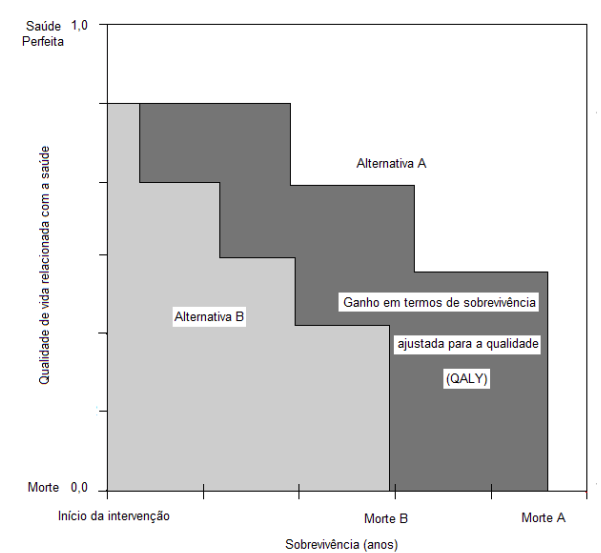
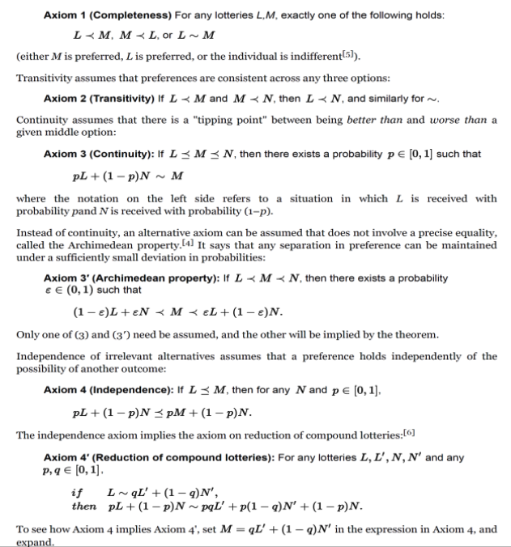
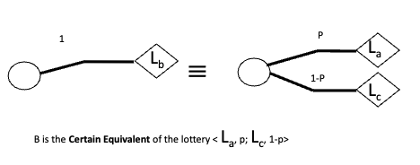
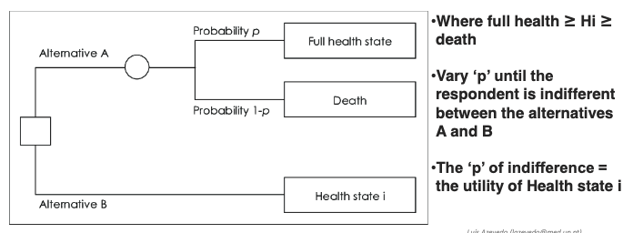
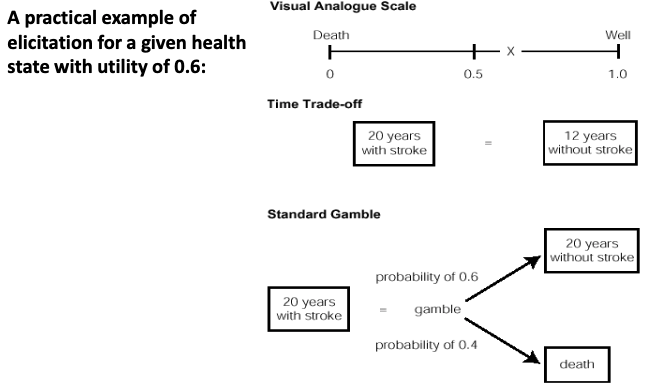

# Lesson 07 - Methods in Decision Analysis and Decision Modelling

## Contexts and paradigms of decision making

- Decision making in health and medicine should take into account a diverse set of health outcome dimensions that should be tailored to the clinical setting, population and patient́s characteristics
- Some of the most relevant types of health outcome dimensions:
  - Mortality
  - Survival
  - Morbidity
  - Functional disability
  - Quality of life
  - Satisfaction
  - Some of these outcome dimensions are difficult to measure and are based on value judgments and preferences, which are dependent upon subjective criteria of individuals, groups or the society where they belong

### Decision Making Perspectives

- Individual perspective
- Society and/or group perspective

**Individual perspective**
- The paramount significance in these settings of the doctor–patient relationship
- In scenarios like these the physician and the patient are faced with a need to make a decision, choosing among a set of different treatment and management strategies
- The best choice will always be the one that best fit the needs and preferences of the patient
- Most patients prefer to be informed about their health problems and the therapeutic and clinical management options
- However, although most of them want to be informed, their willingness and preferred degree of autonomy in the decision-making process is highly variable
- In these settings the healthcare professional needs to be able to perceive and understand what are the patient’s needs and wants regarding information and decision support
- The ideal situation would be one in which the patient is able to apply his or her own sets of values and preferences to inform and weight the potential risks and benefits of each decision alternative; and he or she would be able to choose the option that best maximizes health outcomes taking into account his or her personal and subjective set of preferences
- The healthcare professional should try to perceive, understand, assess and apply the value judgments and preferences of that particular patient, making a decision for the alternative that maximizes the health outcomes for that particular patient taking into account his or her own preferences
- The paramount importance of the doctor-patient relationship and its quality
- This is usually obtained informally and qualitatively during the clinical interview, through a series of questions and an effective communication with the patient

**Perspective of the society/group**
- Many times healthcare professionals and decision makers are faced with decisions that involve not only the more restricted settings where individual perspectives should take primacy but instead involve broader settings where the perspectives of the society or groups of individuals should be taken into account
- In general, this is the relevant perspective in health policy decision-making and decisions regarding healthcare technology
- The decision makers, policy makers, administrators and managers of healthcare services and healthcare systems, and the healthcare professionals in general, are faced with the challenge of turning into a reality the evidence-based decision-making approach and systematically assessing the best treatment and clinical management alternatives for their patients/users/clients, taking into account not only their effectiveness, but also trying to allocate the available limited resources in a balanced and fare way and taking also into account the preferences and value judgments of individuals, groups and the society
- Healthcare decision-making and evidence-based decision making should always take into account the clinical effectiveness of alternatives and the value judgmentsand preferences of the patients/users/clients as a group aiming to maximize health outcomes and never look exclusively at managerial or cost-saving criteria

## Preferences and utilities

- The questions arising when considering the need to assess and apply patient’s preferences are: (1) how to define and measure preferences? and (2) how to develop measures that could be able to take into account simultaneously quality and quantity of life?
- Probabilities of survival, expected survival and life expectancy are measures valued in accordance with their intrinsical meaning and significance; thus, it is easy to predict that individuals will prefer longer periods of survival and higher probability of survival
- Most frequently healthcare policies and interventions affect not only the probability and duration of survival but also the quality of life, functional capacity, disability and morbidity
- Whenever we are interested in systematically assessing and quantifying aspects associated with the quality of life, functional capacity, disability and morbidity there are two key concepts we should take into account:
  - Preferences
  - Utility

**Preferences**
- Level of satisfaction or dissatisfaction, desire or rejection, that individuals, groups or populations associate to a given health state or health outcome

**Utility**
- A quantitative measure of the degree of preference or level of satisfaction or dissatisfaction, desire or rejection, that individuals, groups or populations associate to a given health state or health outcome
- An utility measure should follow a strict set of criteria and axioms that formally define a quantitative measure

**Preferences and Utility**
- When decision analysis takes into account preference-based measures and utilities is called an utility analysis
- Following the same principle, when an economic evaluation, for example, a cost-effectiveness andalysis takes into account preference-based measures and utilities is called a cost-utility analysis
- Preference-based measures and utilities are incorporated in decision analysis or economic evaluations as measures used to weight and value preferences of individuals, groups or the society for certain health states or health outcomes

- A good example are measures such as QALYs
- A measure that allows to calculate the survival time adjusted for and weighted by the preferences of individuals or the society for certain health states or health outcomes
- We intrinsically accept the trade-off between survival time and quality of life; thus, with higher preferences
- To be able to calculate QALYs we will have first to be able to formally and systematically measure preferences and utilities, using explicit, valid and reliable measurement methods and instruments

- Appropriate methods and instruments should:
  - Adequately describe a set of possible health states, from the worst imaginable (defined as death as an anchor) to the best health state possible
  - In those descriptions all relevant attributes should be included (difficult task to accomplish)
  - Quantify preferences of individuals or populations for each health state or health outcome using appropriate preference-based measures with adequate properties (utility measures)

**Utilities**
- Should vary in a continuous numerical scale in the interval 0 to 1, where 0 represents the worst health state possible (assumed to be death as na anchor), with the lesser preference; and 1 represents the best health state imaginable, with the highest preference
- Utilities should be measured in interval scales, meaning that, for example, the difference between preference of a health state with utility of 0.5 and another with 0.4 should be the equal to the difference between a health state utility of 0.3 and another of 0.2
- We will end up with a continuous numerical scale between 0 and 1!
- An example of how to calculate QALYs:
  - Living during 10 years in a health state with 0.5 utility
  - This should be equivalent to live 5 years in a health state with perfect health (utility of 1)
  - QALYs are calculated as follows: 0.5×10 = 5
  - In this case this euqals 5 QALYs; thus, 5 quality adjusted life-years
  This is to say that living 10 years in a health state with utility 0.5 is equivalent to live 5 years in a health state with perfect health

**QALYs and other similar measures**

- **Quality adjusted life-years (QALY)**
  - As previously stated, the great advantage of QALYs as a health outcome measure is to be able to capture and accommodate simultaneously health gains in terms of mortality and survival time (quantity of life) and quality of life/disability/morbidity (quality of life); and combine them in a single measure based on the relative preferences of individuals or the society for different health states or health outcomes
  - To be able to calculate QALYs we should have appropriate preference-based measures, methods and instruments to measure utilities, so as to be used as weights when calculating QALYs, allowing the adjustment for the quality of life of the survival time
  - The measures, methods and instruments described in the subsequent sections are precisely the type of tools used to appropriately generate utilities and adequately adjust for the health related quality of life
  - To calculate QALYs we should always use adequate preference-based utility measures with the following criteria:
    (1) Adequately preference-based following criteria previously discussed
    (2) Be measured in an appropriately calibrated numerically continuous scale in the interval 0 to 1 (with the anchors 0 and 1 as death and the best health state imaginable, respectively)
    (3) To be measured in an interval scale
  - To calculate QALYs we simply multiply utility of a givenhealth state by the expected survival time in that health state
  - Other similar measures with different designations:
  - The US National Centre for Health Statistics uses the term Years of Healthy Life – YHL
  - The Statistics Canada uses the terms Health-Adjusted Person-Years (HAPY) and Health Adjusted Life Expectancy (HALE)

- **Other analogous mixed measures (measuring simultaneously quality and quantity of life)**
  - Healthy-Years Equivalents – HYEs
  - Saved-Young-Life Equivalents – SAVEs
  - Disability-Adjusted Life-Years – DALYs
    - DALYs were developed in the context of the Global Burden of Disease and Injury Study of WHO
    - DALYs have been recommended by WHO in the context of the so called generalised cost-effectiveness analysis

## Theoretical foundations of the concept of utility

- This concept is primarily defined at the beginning of the XXthcentury, in the context of theoreticl developments in game theory, with works focused on decision making under uncertainty currently known as the Theory of Utility of von Neumann and Morgenstern
- They have defined and proposed a set of rules, criteria and axioms establishing how a rational individual should behave when making decisions under uncertainty

### Rules of Actional Thought

- Ronald Howard’s version of the decision making axioms proposed by John von Neumann and Oscar Morgenstern in their classic work on game theory (1944, 1947)
- Simple, intuitive guidelines to follow when making decisions
- A set of five rational, consistent rules for a normative decision maker to follow

#### 1) The Probability Rule

- Decision makers use elemental and compound possibilities and probabilities to provide distinctions and information that characterize deals (choices) and the tradeoffs they entail
  - The clarity test*: Crucial for making clairvoyance meaningful and useful
- Relevance of events
- Mutual exclusion of elemental possibilities
- Collective exhaustion of elemental possibilities

* In decision analysis, the clarity test (or clairvoyant test) is a test of how well a model element is defined. Although nothing (outside a formal system) can be completely defined, the clarity test allows the decision participants to determine whether such elements as variables, events, outcomes, and alternatives are sufficiently well defined to make the decision at hand. In general, a model element is well defined if a knowledgeable individual can answer questions about the model element without asking further clarifying questions.

#### 2) The Order Rule

- Prospects (values of outcomes of deals) can be arranged in a (weakly) descending order from best to worst
- The order of prospects  is consistent and transitive
  - e.g.   A>B, B>C => A>C
  - Nontransitive orders lead to a “money pump” (see Davidson, McKinsey and Suppes, 1955)

#### 3) The Equivalence Rule

- If A>B>C, then there is a number 0<\p<1 such that the decision maker is indifferent between getting prospect B for sure, and receiving a deal with probability p of getting A and probability 1-p of getting C
  - P is the preference probability of this model
  - B is the certain equivalent of the A,C deal

**Preference Probabilities**

#### 4) The Substitution Rule

- The decision maker has to be indifferent between receiving a prospect and any deal for which that prospect is a certain equivalent
  - B can be substituted for the A,C deal in any situation
  - Implies treatment of preference probabilities as probabilities that might lead to action

#### 5) The Choice Rule

- If the prospect ordering includes D>E, and there are two deals with outcomes D,E, the decision maker must prefer the deal in which the probability of getting D is higher
  - The only specific-action rule
  - Simply states that decision makers follow their preferences, whatever these are

### Lotteries and Normative Axioms

- John von Neumann and Oscar Morgenstern (VNM) in their classic work on game theory (1944, 1947) defined several axioms a rational (normative) decision maker might follow with respect to preference among lotteries
- The VNM axioms state our rules of actional thought more formally with respect to preferring one lottery over another
- A lottery is a probability function from a set of states S of the world into a set X of possible prizes

#### Utility Functions

- Assuming a lottery f with a set of states S and a set of prizes X, a utility function is any function u:X x S -> R (that is, into the real numbers)
- One important utility function of an outcome x is the one assessed by asking the decision maker to assign a preference probability among the worst outcome X0and the best outcome X1
  - Note: There must be such a probability, due to the continuity axiom (our equivalence rule)

#### The Continuity Axiom
If  there are lotteries La, Lb, Lc; La > Lb > Lc (preference relation), then there is a number 0<\p<1 such that the decision maker is indifferent between getting lottery Lb for sure, and receiving a compound lottery with probability p of getting lottery La and probability 1-p of getting lottery Lc
- P is the preference probability of this model
- B is the certain equivalent of the La, Lc deal

#### The Expected-Utility Maximization Theorem

- Theorem: The  VNM axioms are jointly satisfied iff there exists a utility function U in the range [0..1]  such that lottery f is (weakly) preferred to lottery g iff the expected value of the utility of lottery f is  greater or equal to that of lottery g
  - Note: The proof shows that the preference probability (and its linear combinations) in fact satisfies the requirements

#### Implications of Utility Maximization to Decision Making

- Starting from relatively very weak assumptions, VNM showed that there is always a utility measure that is maximized, given a normative decision maker that follows intuitively highly plausible behavior rules
- Maximization of expected utility could even be viewed as an evolutionary law of maximizing some survival function
- However, in reality (descriptive behavior) people often violate each and every one of the axioms!

#### The Allais Paradox (Cancellation)

## Methods for Measuring Preferences and Utilities

- It is common to use instruments or questionnaires designed to measure health related quality of life (HRQoL) as indirect measures of preferences and utilities; however, not all instruments designed to measure HRQoL are appropriate to measure preferences and utilities; thus, not all of them are useful in the context of utility analysis, cost-utility analysis or to calculate QALYs
- Preference-based measures may be categorized in two groups – direct measures and indirect measures
  - In direct measures the elicitation of preferences for a given set of health states is performed directly in individuals or samples from the target population using one of the direct methods of preferences elicitation (utility estimation) – standard gamble, time trade-off or direct measurement or classification scales
  - In indirect measures the elicitation of preferences is performed based on the set of individual responses or calculated indices from an HRQoL instrument (health profile) linked to a set of weights coming from an independent source where they have been defined as to appropriately represent the preferences (utilities) of the target population for each health state

### Direct Methods

- Standard gamble
- Time trade-off
- Direct measurement or classification scales
- Other methods

**Standard Gamble**
- This is a method suggested by the utility theory of von Neumann and Morgenstern itself and it is considered as the reference gold standard method for measuring preferences and utilities; because it adequately represents the conceptual framework and the experimental operational conditions of decision making under uncertainty
- The practical application of this method puts the individuals in an hypothetical situation where he has to choose between two alternatives
- One of the alternatives is to stay permanently in a given health state i and the other alternative entails a sort of gamble with two possible outcomes –full health state and death –with certain known probabilities of occurrence –p and 1-p, respectively
- In order to elicit the subject’s preference and utility of a given health state i, the participant is subjected repeatedly to this hypothetical decision scenario with varying values of ‘p’, and is asked to make a decision as to what alternative he prefers
- The utility elicitation exercise ends when the subject reveals his point of indifference, the value of ‘p’ for which he is indifferent between the two alternatives available
- The value ‘p’ revealed as the point of indifference corresponds to the utility of the health state i

**Time trade-off**
- The time trade-off (TTO) method was proposed as an alternative to the standard gamble by Torrance, Thomas and Sackett in 1972
- The participant is also subjected to an hypothetical decision making scenario with two alternatives:
  1 –The health state i during a period of time t (e.g. expected survival of subjects with a given chronic disease), followed by death
  2 –The full health state during a period of time x < t, followed by death
- The duration of the period of time x is repeatedly changed until a point of indifference is defined where the individual has equal preference or is indifferent between the alternatives
- The preference and utility of health state i given by the time trade-off method is calculated as the ratio x / t at the point of indifference
- The underlying concept is the trade off between quantity and quality of life as measured by the preference of individuals for shorter or longer periods of time in a given health state
- As an example, an individual may be willing to accept 9 years of expected survival time without angina pectoris in exchange for 10 years of expected survival with angina pectoris
- The preference or utility for this health state is given by the ratio between the time period associated with the full health state and the time in the health state under evaluation, at the indifference point; thus, in this case the utility of angina pectoris as measured by the time trade-off method would be 9/10 or 0.9

**Direct measurement or classification scales and visual analogue scales**
- Qualitative ordinal rating scales (ordinal rating scales with descriptors assumed to be equally spaced along the scale construct)
- Numeric rating scales (numeric rating scale –NRS, for example, 0-100)
- Visual analogue scales (visual analogue scales –VAS, usually a 10 centimetres line in a blank page with clear limit lines)
- Combined methods, as an example, McMaster university uses a “feeling thermometer”, resulting from the combination of a VAS and a 0-100 NRS

### Indirect Methods

- Measuring preferences and utilities using the direct methods just described may be a difficult and time consuming task
- A more practical alternative often used is the elicitation of preferences and utilities using indirect methods based on the classifications or ratings of generic HRQoL measures associated with a set of preference weights obtained independently that allow the indirect estimation of preferences and utilities of different health states
- It is common to use instruments or questionnaires designed to measure health related quality of life (HRQoL) as indirect measures of preferences and utilities; however, not all instruments designed to measure HRQoL are appropriate to measure preferences and utilities; thus, not all of them are useful in the context of utility analysis, cost-utility analysis or to calculate QALYs

**Multi-attribute health status classifications systems associated with preference measures**
- Within the broader set of all the generic HRQoL measures there are a subgroup of instruments including multi-attribute health status classification systems linked to preference weights algorithms allowing the estimation of preferences and utilities for different health states
- These subgroup of instruments allow the characterization of each health state using a multi-attribute classification system (e.g. mobility, personal care, activities of daily living, social function, anxiety-depression, pain, etc.) and estimate preferences and utilities using preference weights algorithms, developed through direct valuation exercises –valuation experiments –in representative samples from the target population
- Valuation research aims to measure people’s preferences with respect to health. This involves the participation of a representative sample of people from the target population in a standardized valuation experiment
- In the experiment, participants are asked to value health by reviewing health states described by the multi-attribute classification system
- The result from the valuation study is a value set for that target population
  - This is essentially a set of weights for each of the levels of the multiple dimensions. A large weight means that people believe that a particular level of severity has a large impact on health-related quality of life.
  - Using the set of weights, one can convert each health state described by the multi-attribute system into a single summary index value corresponding to the estimate of the preference or utility of that health state according to the target population valuations
-  The most popular systems or instruments of this kind are:
  - Quality of Well-Being (QWB)
  - Health Utility Index (HUI)
  - EQ-5D do EuroQoL Group
  - Short Form 6D (SF-6D) associated with the Medical Outcomes Study –Short Form 36 (SF-36)

- EQ-5D
  - The EuroQoL Group initially developed a multi-attribute classification system with 6 attributes: mobility, self-care, usual activities, social interactions, pain/discomfort, and anxiety/depression
- Subsequently a revised version was developed with the current five dimensions:
  - mobility,
  - self-care,
  - usual activities
  - pain/discomfort
  - anxiety/depression
- The most current version has five levels for each dimension (no problems, slight problems, moderate problems, severe problems and being unable to do/extreme problems), defining 3,125 possible health states. The original version had 3 levels in each dimension
- The models or algorithms available to calculate estimates of preferences or utilities for each health state form 0 (death) to 1 (full health) were developed form representative samples of several different populations using valuation experiments based on TTO or SG

